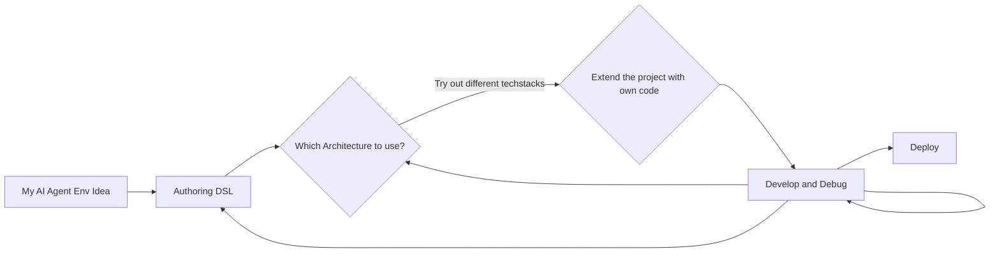

# Agenterprise:  ⚓ + 🪽

## AI projects with ⚓ anchors and 🪽 wings

 
## ⚓ Anchors
In the DSL you provide you abstract AI Environment. A generator will generated a solid water proof baseline --> the anchor ⚓

## 🪽 Wings
Give you project wings by extending it without loosing  ability to adjust your dsl project and regenerate. -->  the 🪽 Wings

### About Agenterprise
NOTE: Agenterprise is currently in Alpha Phase

- Model-driven, agentic enterprise software meets GenAI
- Architecture decoupled from technology
- Liveline from PoC to Enterprise Setups
- Open source stability reduces technology and vendor logi

- Set based design

Agenterprise is an open source project focused on model-driven software development for agentic enterprise architectures and beyond. The goal is to enable intelligent solutions that remain independent of specific libraries and frameworks, by decoupling architecture from technology choices.

With Agenterprise's domain-specific language (DSL), you can describe your AI and agentic architectures in a technology-neutral way. This makes it possible to generate different tech stacks or service stacks from the same model, adapting flexibly to changing requirements or platforms.

This approach allows:

- Separation of business logic and technical implementation
- Decoupling enterprise architecture from vendor or framework dependencies
- Integration with various AI and agent technologies

Generative AI is rapidly accelerating software development. However, if you need a stable, enterprise-ready foundation that can be combined with GenAI features, Agenterprise provides a robust and flexible base to build on.

Agenterprise invites everyone interested in flexible, scalable, and sustainable software to explore model-driven development and DSLs for agentic enterprise solutions.
